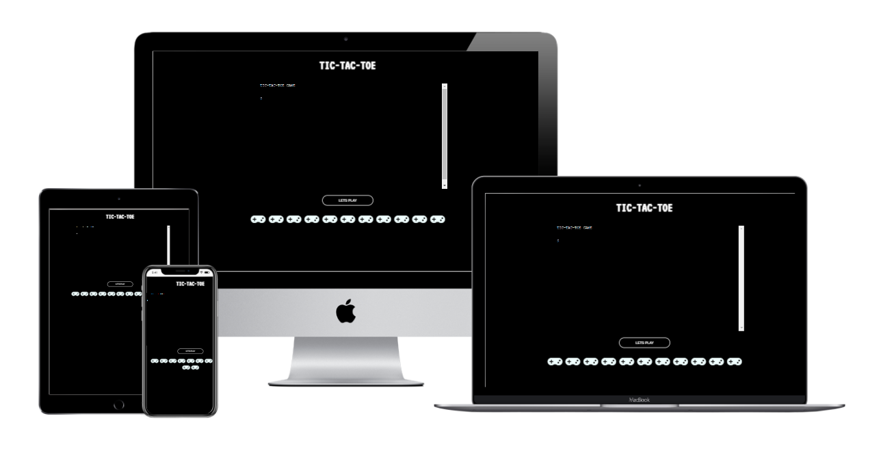
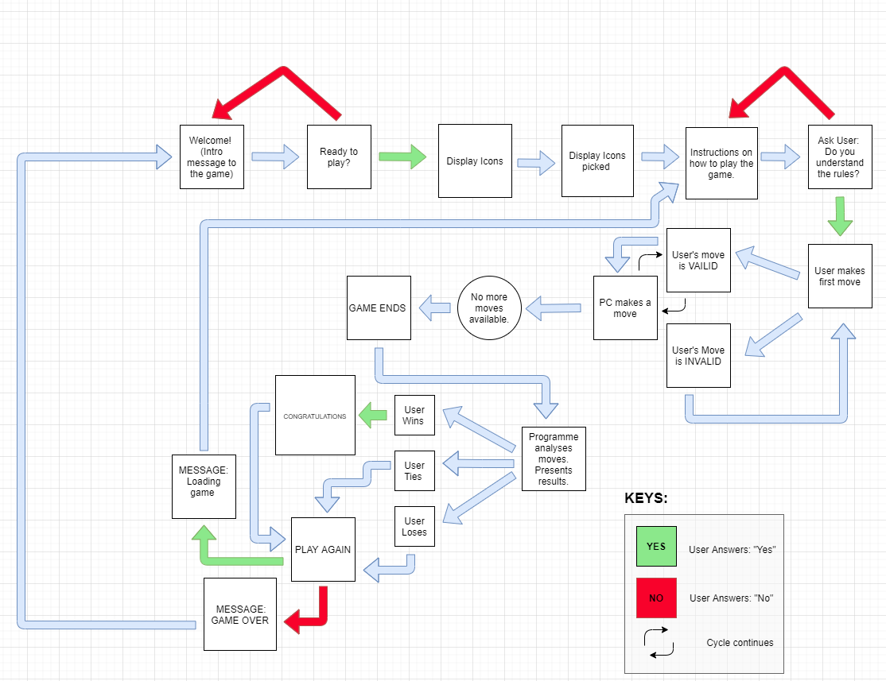
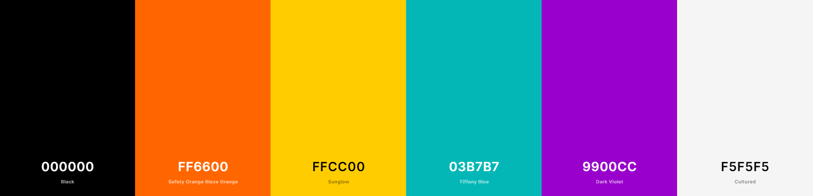

# List of Contents

1. [Overview](#1-Overview)
2. [User Experience (UX)](#2-User-Experience-UX)
3. [Content](#3-Content)
4. [Features](#4-Features)
5. [Technologies Used](#5-Technologies-Used) 
6. [Testing](#6-Testing)
7. [Deployment, Access & Extensions](#7-Deployment-Access-and-Extensions)
8. [Credits](#8-Credits)
9. [Acknowledgements](#9-Acknowledgements)
10. [References](#10-References)

# **TIC-TAC-TOE**

## 1. Overview

The Tic-Tac-Toe (TTT) programme intends to pay homage to a simpler time, where competitors would get a one-up on eachother through a simple match of Xs & Os. This programme operates as traditional TIC-TAC-TOE, however, it has incorporated some additional elements such as emojis instead of X and Os. Would you like to play?  

**Features Overview** 

<!-- ## 2. User Experience (UX)

The [‘5 Planes of UX Design Model’ (5PUXD)](https://medium.com/designcentered/ux-design-5-planes-method-b1b1d6587c05#:~:text=The%20five%20planes%20%E2%80%94%20strategy%2C%20scope,the%20problem%20as%20a%20whole) provides **five** core principles used when creating Programmes and applications.These principles are: 

- Strategy
- Scope
- Structure
- Skeleton
- Surface

The **Strategy** and **Scope** plane in the 5PUXD model suggest that consumer trends, needs and competing services should be considered before designing applications. Arguably, these factors are essential to identifying the core deliverables of the application and its services being offered. It also helps designers clarify the applications’ relevance withing the respective industry and potential market demand.
As such, brief market research was conducted to gain insight into competing services (e.g. ) and user psychographics. It also helped identify the target audience and the perceived objectives (goals) of the programme owner and users’ (first-time and re-occurring) who visit the programme. This is discussed in more detail below.

### **2.2 Competitor Analysis**

As part of competitor analysis, the following language applications were reviewed. Analysis of such applications assisted in the conceptualisation and creation of the Programme’s User Experience Deign. 

Below is a list of some of the Programmes and applications reviewed:

- 

**2.2.1 Valuableness of Programme** 

**2.2.2 Competitor Analysis**

### **2.3 Key Psychographic(s)**

### **2.4 Key Demographic(s)**

### **2.5 User stories: programme Owner and User goals**

#### **2.5.1 Goals: First-time user** 

#### **2.5.2 Goals: Re-occurring user** 

#### **2.5.3 Goals: programme Owner**  -->

## 3. Content

This section discusses various design elements of the programme. Formulating and executing such elements were integral the development of the programme. Arguably, consideration of these factors echoes the premises of the latter planes of the 5PUXD Model. For instance, when designing the programme, it was essential to identify the required information of the programme (structure) and how users can access this content (skeleton).

### **3.1 Logistics: Flow Chart** 

Creating a Flow Chart for the programme helped to highlight the limitations and strengths of the programmes operation. It also allowed a more accurate analysis of which elements were feasible to execute within the project time frame and which could be implemented if the programme could be expanded on in further development. 

### **3.2 Fonts**

The following fonts were used for the programmes hosting page:

- **VT323**
- **Ubuntu**

These fonts were used as the default set by the bowser did not compliment the overall design of the hosting page. 

### **3.3 Colour Pallet**

The following [colours](https://coolors.co/000000-ff6600-ffcc00-03b7b7-9900cc-f5f5f5) were used for the theme of the TTT game's hosting page: 

- **#F5F5F5**
<!-- white-->
- **#9900cc**
<!-- purple -->
- **#03b7b7**
<!-- aqua -->
- **#ffcc00**
<!-- yellow -->
- **#ff6600**
<!-- orange -->
- **#000000**
<!-- black -->

## 4. Features

<!-- This section provides an overview of the features on the Programme, and where relevant, the way in which theses feature(s) address the users’ stories, mentioned in prior sections. -->

### **programme-wide features**

| Goal Number| Description|
|-----|-----|
| ---------------- | ---------------------|

## 5. Technologies Used

### **5.1 Languages**

- **HTML**: This source code supported the fundamental structure of theprogramme. 

- **CSS**: This source code supported the core styling elements of theprogramme.

- **JavaScript**: This source code supported the dynamic features/capabilities of theprogramme. 
- **JQuery**: Supported specific functionalities (e.g. _____________________) within the programme through simplifying ‘Document Object Model’ (DOM) manipulation (Developer.mozilla.org, 2021).

### **5.2 Applications, Libraries and Resources**

-   [Cite This for Me](https://www.citethisforme.com/)
-   [Coolors](https://coolors.co/)
-   [Diagrams.net](https://www.diagrams.net/)
-   [Font Awesome](https://fontawesome.com)
-   [GitHub](https://github.com/)
-   [GitPod](https://www.gitpod.io/)
-   [Google (Chrome) Development Tools](https://developer.chrome.com/docs/devtools/open/)
-   [Google Fonts](https://fonts.google.com/)
-   [Responsively](https://responsively.app/download) 
-   [Stack Overflow](https://stackoverflow.com/)
-   [VSCode](https://code.visualstudio.com/)
-   [W3 Schools](https://www.w3schools.com/)
-   [W3.CSS](https://www.w3schools.com/w3css/default.asp) 
-   [Youtube](https://www.youtube.com/) 

### **5.3 Testing Applications** 

The following applications were used to test various aspects of theprogramme. Meeting these requirements were essential to the programme complying with accessibility, coding and performance standards within the programming industry.

-   [Dillinger](https://dillinger.io/)
-   [Online Python Compiler](https://www.programiz.com/python-programming/online-compiler/)
<!-- -   [(Jigsaw) Validator](https://jigsaw.w3.org/css-validator)
-   [JSHint](https://jshint.com/) -->
<!-- -   [Lighthouse](https://developers.google.com/web/tools/lighthouse)
-   [Wave](https://wave.webaim.org/)
-   [W3C Validator](https://validator.w3.org/) -->

## 6. Testing

### 6.1 **HTML, CSS and JS Validator Tests**

To ensure that the HTML, CSS and JS source-code adhered to industry standards, each were run through respective validators:

- [W3C Validator](https://validator.w3.org/)
- [(Jigsaw) Validator](https://jigsaw.w3.org/css-validator)
- [JShint Validator](https://jshint.com/). 

All the tests produced **_**. Evidence of the tests can be found in the testing repository directory, [here](docs/testing).

### **6.2 WAVE: Programme Accessibility Test**

The [WAVE Accessibility Evaluation Tool](https://wave.webaim.org) was used to evaluate the overall accessibility of ____________programme. It considered factors such as the quantity and suitability of accessibility features used on the Programme (e.g. aria-labels, degree of contrast). The results produced **_**, thus passing the overall test. 

### **6.3 LIGHTHOUSE: Programme Performance test**

The [Lighthouse](https://developers.google.com/web/tools/lighthouse#devtools) was used to test the performance of the _________________. In relation to performance, the tests indicated that the Programme would operate at an optimal level on desktop devices where each page achieved a score between **91-99 out of 100**. Evidence for the results of each page can be found [here](docs/testing/lighthouse-results).

### **6.4 Programme Responsiveness**

Regarding the Programme’s degree of responsiveness, the programme was accessed on multiple devices (incl. mobile, tablets, desktop, and larger devices) and multiple browsers (incl. FireFox, Google Chrome and Microsoft edge). The __________________ appears to respond appropriately to the changing device screen sizes and altering of browser’s size. Evidence of this is provided below: 

### **6.5 Bugs**

While there were several bugs that arose through the duration of the project, the most notable fixed and unfixed bugs are discussed in more detail below. 

#### **6.5.1 Fixed bugs**
- **Context:** 
- **Reason:** 
- **Fix:** 

<!-- assigning selected emoji to player > used 'global' -->
#### **6.5.2 Unfixed bugs**

<!-- **[moving .j and .css to right file so programe would run]** -->

- **Context:** 
- **Reason:** 
- **Potential Fix:** 

## 7. Deployment, Access and Extensions

The __________________ programme was deployed locally and online via the use of GitHub (web application), GitPod, Git Bash, Heroku and an IDE such as VS Code. In order to access the repo locally, a ‘repo’ - specific SSH Key was created and used also. An overview of how the programme was accessed and deployed are outlined in the sections below. 

### :unlock: 7.1 Access: Local Clone 

|The Process – :key: SSH Key| 
|-------------|
|Note: You will need this key to clone the repo to the local space (e.g. on the desktop).|
|1.	Download the GitBash application and create a SSH key. How to create a SSH key can be found [here]( https://inchoo.net/dev-talk/how-to-generate-ssh-keys-for-git-authorization/).|
|2.	Sign into [GitHub](https://github.com/).|
|3.	Click the profile icon in the top-right corner of the GitHub webpage, click **Settings**.|
|4.	Click SSH and GPG Keys tab on the left-hand menu.|
|5.	Click **‘New SSH Key’**, then copy and paste the key code (created via GitBash) into the box under the **’Key’** title.|
|6.	Click **’Add SSH Key’**, and then the key will then be ready to use!|

|The Process – Local Clone to an IDE of choice| 
|-------------|
|1.	Click the **’+’** icon in the top-right icon on the web browser and select **‘New Repository’**. You will then be directed to a webpage titled ‘Create a new repository’.| 
|2. Fill out the required areas. Ensure the repository has been assigned a name and has a README.md created. The README file can be added by selecting the **'Add a README file'** option at the bottom of the ‘Create a new repository’ form.|
|3.  Copy the SSH key from the repo. See blow on how to do this: |

| :key: Implementing SSH Key |
|-------------|
|3.1 Open GitHub and navigate to the repo you want to clone.|
|3.2 Click the **’Code’** button in the top-right corner of the repo window.|
|3.3 Click the SSH Key tab.|
|3.4 Copy the SSH key via right click and copy or clicking the clipboard icon.|
|3.5 On the desktop, open VSCode.|
|3.6 On the taskbar at the top of tab, click the **File** tab.|
|3.7 Select the folder you want to clone the repo to.|
|3.8 In the terminal box, type **‘git clone’**.|
|3.9 Then copy the SSH key after the git clone command. Then press enter.|
|3.10 The terminal should present the pathway to the cloned repository. For instance, this ___________ project will display the following in the VSCode’s terminal:| 
|- **…C:\Users\missm\Documents\GIT\__________>**|
|3.11 Once cloned, you will be able to edit the repo locally and commit, pull and push changes to the online GitHub repo (remote repository) using terminal commands (e.g. 'git push', 'git add .' and 'git pull').| 

### :unlock: 7.1.1 Access: GitPod Workspaces

Below is an overview on how to access project via [GitPod](https://gitpod.io/workspaces) which can be accessed directly via the main site or via GitHub. This method was used in the process of writing the code for the ______________ programme:

|The Process| 
|-------------|
| 1. Create a project **repository** on [GitHub](https://github.com/) using a registered GitHub account.|
|2. Once the repository is created, on the repo page, click on the GitPod icon above the repo. This will then direct you to GitPod. Further information on how to get started with GitPod can be found [here](https://www.gitpod.io/docs/getting-started).|
|3. Once you have accessed (and signed in, if prompted) GitPod, open a new tab. Type or paste the following URL into the new tab: **https://gitpod.io/workspaces**.|
|3.1 **‘Pin’** the unique repo name on the GitPod Workspace. nThis can be accessed by the ellipses button on the right-hand side of the unique repo name. This pin will be deleted automatically if it has not been accessed within 7 – 14 days. |
|4. Once these steps are taken, you can the access, edit and create changes to the repo using commit, pull and push commands (e.g. 'git push', 'git add .' and 'git pull'). These will update the online GitHub repo (remote repository) also.| 

<!-- ### 7.2 Extensions Install:  Python Extensions
|The Process – Installing Python v3 and later| 
|-------------|
||

|The Process – Installing Python extension for IDE| 
|-------------|
|-----------|
|Notes on interpreter selection too|

Below is an overview on how to deploy a project via GitHub’s GitHub Pages. This method was used to deploy the __________ Programme:

|The Process| 
|-------------|
| 1. Create a project **repository** on [GitHub](https://github.com/) using a registered GitHub account. |
|2. Once the repository is created, click on the repository, then the **Settings** tab, this is the last tab in the top right of the repository’s **navigation bar**. |
|3. Once on the settings page, navigate to and click on **Pages** (titled as ‘Pages’ as of May 2021) listed in the left-hand menu pane. |
|4. Under the header - **Source**, select **master branch** from the drop-down list. This will change the neighbouring selector box to **/(root)**. |
|5. Then click **Save**. |
|6. Wait for a minute and then **refresh** the webpage. |
|7. Once refreshing, a green box with the text and clickable link; **'the programme is published at...'**. | 
|8. Clicking on the Programme’s hyperlink in the green box will direct to the live deployed
programme. | -->

### 7.3 Deployment: Heroku

Below is an overview on how to deploy a project via Heroku. This method was used to deploy the ________________Programme. 

|The Process| 
|-------------|
|**NOTE:** Prior to deploying, the repository had all changes saved and the following code - _**'pip freeze > requirements.txt'**_ was typed into the terminal. Running this command through the terminal updtated the 'requiremnet.txt' with all the imported modules. Final commit and push commands were made to the repo. From this point the programme was deployed online via Heroku (with Git).|
||
| 1. Once signing up to the free version of Heroku; create a new app via [Heroku’s landing page](https://dashboard.heroku.com/apps). This can be done by clicking the **’New’ button** on the landing page and **’Create a new app’** from the drop-down menu. |
|2. Fill out the requested information. |
||
|**NOTE:** If the programme has specialised/ secured content (e.g. personal data or uses a API), there is need to supply the appropriate configuration settings. This can be done by accessing the **Settings** page of the app. [Code Institute](https://learn.codeinstitute.net/courses/course-v1:CodeInstitute+LS101+2021_T1/courseware/293ee9d8ff3542d3b877137ed81b9a5b/e3b664e16366444c8d722c5d8340b340/?child=last) provides further guidance on how to apply such settings. However, no configuration settings were set for the __________ programme as it was not needed. |
||
|2.1 In order for the _______ programme to run, the **Heroku/python and Heroku/nodejs** were selected as part of the Buildpacks option. This allowed the python code to run in the terminal whilst being hoseted on Heroku.|
||
|**NOTE:** As outlined in  [Code Institute’s](https://learn.codeinstitute.net/courses/course-v1:CodeInstitute+LS101+2021_T1/courseware/293ee9d8ff3542d3b877137ed81b9a5b/e3b664e16366444c8d722c5d8340b340/?child=last) guidance, the **Heroku/python and Heroku/nodejs**  Buildpacks **must** be selected in this order in order for the code to run optimally. |
||
|3. Once the settings are configured, navigate to the **Deploy page** via the neighbouring tab of the app. On this page choose the appropriate ‘Deployment Method’ (e.g. GitHub). |
|4. Once selecting the method, log into the respective account and select the repo that is to be shared. |
|5. Once connected, select either the automatic or manual deployment option. This can be fount on the last two rows of the Deploy page. For the ______programme app, the manual deploy option was selected by clicking the **’Deploy Branch** button.  The domain for the programme can be accessed via the Settings and Deploy pages, this is in the ‘Domains’ and ‘Manual Deploy’ rows of each respective page. |
||
|**NOTE:** As this is an overview of deploying a programme via Heroku (with Git) - further guidance on deployment practice can be found [here](https://devcenter.heroku.com/articles/git). |

## 8. Credits

### **8.1 The Project** 

#### **8.1.1 Project Goals**

#### **8.1.2 Chosen Project Idea** 

### **8.2 Content** 
Particular mention is paid to the following creators and their content as the resources assisted in the overall execution of the project.

-	**Repository Elements**

    The fundamental content of Code Institute’s [Python Essentials repository template]( https://github.com/Code-Institute-Org/python-essentials-template) was amedned and used to form the base of this programme's repositoy. The repository includes some existing, HTML, CSS, JS and JSON code which has not been changed or removed from the repo. It was essential to utilise this template for the python code to function effectively.

-	**Game Concept & Structural Planning** 

    Dawson (2010) – Specifically, page 157-58 and 175-1987 of Dawson’s book assisted greatly in approaching the  planning stages of the project.  

### **8.3 Language, Scripts and Modules**

- **JavaScript:** 

    The JavaScript used within the code was part of the  Code Institute’s [Python Essentials repository template]( https://github.com/Code-Institute-Org/python-essentials-template). It has not been edited for the programme to function effectively. 

- **Emoji Module:** 

    The Emoji module was imported into the Python script  in order for the emoji icons to be displayed in the terminal. The module was sourced from [Emoji by PyPi](https://pypi.org/project/emoji/) ( PyPI , 2021).

- **Font Awesome:** 
    
    FontAwesome’s CDN - https://kit.fontawesome.com/1699136767.js, was used in order for it to support the icon elements used on the index page.  

### **8.4 Media** 

## 9. Acknowledgements

## 10. References

### :books: Books
- **Ascher, D., Martelli Ravenscroft, A. and Martelli, A., 2005. Python cookbook edited by Alex Martelli and David Ascher. United States: O'Reilly.**
- **Dawson, M., 2010. Python programming for the absolute beginner. Boston, Mass.: Course Technology.**
- **Martelli., A., 2006. Python in a Nutshell. O'Reilly Media.**
- **Nixon, R., 2018. Learning PHP, MySQL et JavaScript. O'Riley Media Inc.**

### :computer: Online Resources 

- **Azu, I., 2013.** -["If" statement without the "else" | Codecademy.](https://www.codecademy.com/forum_questions/526868e5548c352551000f60#:~:text=An%20if%20statement%20looks%20at,else%20statement%20is%20not%20needed)

- **cdnjs. 2021.** - [font-awesome - Libraries - cdnjs - The #1 free and open source CDN built to make life easier for developers](https://cdnjs.com/libraries/font-awesome)

- **Docs.python.org. 2021.** - [Python Module Index — Python 3.9.6 documentation](https://docs.python.org/3/py-modindex.html)

- **Gribouillis, 2010** - [Restart your python program](https://www.daniweb.com/programming/software-development/code/260268/restart-your-python-program)

- **Guru99.com. 2021.** - [Python time.sleep(): Add Delay to the Code (Example)](https://www.guru99.com/python-time-sleep-delay.html#2)

- **O’Reilly Online Learning. 2021.** - [Effective Computation in Physics](https://www.oreilly.com/library/view/effective-computation-in/9781491901564/ch04.html)

- **PyPI. 2021.** - [emoji](https://pypi.org/project/emoji/)

- **Prajapati, K., 2020.** - [How to print 😁😛😋🤣emojis using python🐍](https://medium.com/analytics-vidhya/how-to-print-emojis-using-python-2e4f93443f7e)

- **Pythonprinciples.com. 2021.** - [Print Vs Return – Python Principles](https://pythonprinciples.com/blog/print-vs-return)

- **Python.org. 2021.** - [Python Release Python 3.9.6.](https://www.python.org/downloads/release/python-396/)

- **Pythondocs.readthedocs.io. 2021.** - [Python Intro 1.0 documentation](https://pythondocs.readthedocs.io/en/latest/)

- **Ratnakumar, S., 2020.** - [How to prevent favicon.ico requests? Stack Overflow.](https://stackoverflow.com/questions/1321878/how-to-prevent-favicon-ico-requests)

- **Seitz, T., 2012.** - [Picking a Color Palette for Your Game's Artwork | Game Development Envato Tuts+](https://gamedevelopment.tutsplus.com/articles/picking-a-color-palette-for-your-games-artwork--gamedev-1174)

- **Unicode.org. 2021.** - [Emoji List, v13.1.](https://unicode.org/emoji/charts/emoji-list.html#1f926_200d_2642_fe0f)

- **W3schools.com. 2021.** - [Python Operators](https://www.w3schools.com/python/python_operators.asp)

