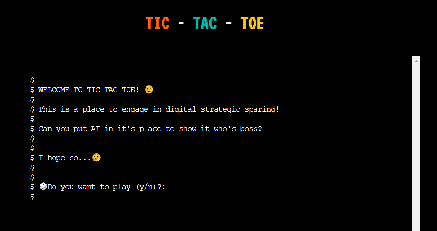
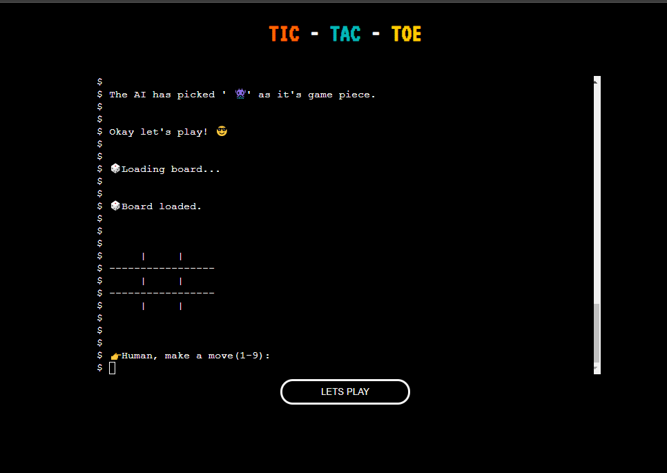

# List of Contents

1. [Overview](#1-Overview)
2. [User Experience (UX)](#2-User-Experience-UX)
3. [Content](#3-Content)
4. [Features](#4-Features)
5. [Technologies Used](#5-Technologies-Used) 
6. [Testing](#6-Testing)
7. [Deployment, Access & Extensions](#7-Deployment-Access-and-Extensions)
8. [Credits](#8-Credits)
9. [Acknowledgements](#9-Acknowledgements)
10. [References](#10-References)

# **TIC-TAC-TOE**

## 1. Overview

The Tic-Tac-Toe (TTT) game intends to pay homage to a simpler time, where competitors would get a one-up on each other through a simple match of Xs & Os. This programme operates in the same way as the traditional TIC-TAC-TOE, however, it has incorporated some additional elements such as the use of emojis instead of Xs and Os. 
With that said, would you like to play?  

**Features Overview** 

-	**Emoji ‘Game Pieces’** 
    The user can select their desired icon from the list of icons provided. This shall be discussed in more detail in the [Features](#4-Features) section of this README. 

-	**‘Let’s Play’ button**

    This feature allows the user to refresh the application instantly. This too shall be discussed in more detail in the [Features](#4-Features) section of this README.

## 2. User Experience (UX)

The [‘5 Planes of UX Design Model’ (5PUXD)](https://medium.com/designcentered/ux-design-5-planes-method-b1b1d6587c05#:~:text=The%20five%20planes%20%E2%80%94%20strategy%2C%20scope,the%20problem%20as%20a%20whole) provides **five** core principles used when creating Programmes and applications.  These principles are: 

- Strategy
- Scope
- Structure
- Skeleton
- Surface

While these concepts were considered in the initial stages of forming the application, there was a primary focus on the programme’s structure. Most of the planning was dedicated to the ‘flow logic’ and ‘flow control’ of the programme itself. 

Nonetheless, to present an effective functioning programme that is also appealing, the following considerations were made in relation to the 5PUXD planes: 

### **2.1 Strategy & Scope**

The two scopes above, suggest that trends, needs and competing services should be considered before designing applications. In relation to this application, there is not a specific need or consumer demand for the game. Arguably, the game is well known and there are multiple variations of the game. Despite this, there was a need to create a version of game that differed from the traditional Tic-Tac-Toe game design, which uses X and Os. 

### **2.2 Structure**

This plane encourages designers to consider how the programme will function and the functional requirements of the game. Given that the game would be built through python script, there was a need to consider how the script would be optimally presented in the terminal.  One of the salient steps to creating the programme was establishing the programme’s flow. Specifically, it was essential to the programme’s success to identify;

1. What actions the programme needs to execute, 
2. What functions were needed, 
3. Which order the code blocks would need to be executed in, and 
4. How they would be executed. 

This is discussed in more detail in the [Content](#3-Content) section of the README.  

### **2.3 Skeleton and Surface**

Arguably, these planes encourage designers to focus on building the user interface (UI) for an application or website. As the primary purpose of the site is to run an effective functioning game via Python, less time was allocated to the visual design of the programme. As such, the hosting page has few interface elements (e. g. buttons and media links). Similarly, the aesthetics of the site has a simple and clean design. The primary motive behind this choice was to echo nostalgic retro aesthetics, games such as Pac-Man, Tetris and Super Mario bros.  

### **2.4 Valuableness and Relevance of the programme** 

Given current social norms, it can be argued that using Emojis instead of Xs and Os for the game’s board pieces can contribute to increased use of the game due to the popular use of Emojis.  
Arguably, Emojis have become increasingly relevant to communication practice within many societal cultures. That is, given the rise of technology, Emojis are commonly used in communications by multiple user demographics (i.e. varying in age, culture, gender etc.).  

Moreover, findings from many contemporary studies and [articles](https://www.independent.co.uk/voices/emoji-generational-divide-smiley-b1900591.html)  indicates that Emojis used in conversation can have just as much contextual meaning as words (Stevenson, 2021). 

### **2.5 User stories: programme Owner and User goals**

Below are the following goals of both the users and owner, in this case designer, of the TTT game:

#### **2.5.1 Goals: First-time user** 

As a first-time user, I...

1.	Expect to interact with a game that is easy to use. 
2.	Want to play a game that is based on strategy and logic.
3.	Intend to play against an online competitor, such as the computer.

#### **2.5.2 Goals: Re-occurring user** 

As a re-occurring user, I...

4.	Want to beat the computer in a logic game.
5.	Want to be able to play the game on multiple devices (e.g. phones, tablets, and desktop/laptop devices).

#### **2.5.3 Goals: Application creator /Site owner** 

As an Application creator / Site owner, I...

6.	Intend to design a UI that is easy to use and navigate around. 
7.	Want to create and implement a programme that catches invalid responses and responds to users’ input.
8. Want to provide the user with a feature that allows them to personalise their response and visualise their movement(s) in the game. 
9.	Want to create and host an online game that can be used on multiple devices (e.g. phones, tablets and desktop/laptop devices).

## 3. Content

This section discusses various design elements of the programme. Formulating and executing such elements were integral the development of the programme. Arguably, consideration of these factors echoes the premises of the latter planes of the 5PUXD Model. For instance, when designing the programme, it was essential to identify the required information of the programme (structure) and how users can access this content (skeleton).

### **3.1 Logistics: Flow Chart**

#### 3.1.1 Creating an algorithm

Following the advice provide in Dawson's chapter on Object Oriented Programming; a basic algorithm was created for the TTT programme. The algorithm outlined the core actions that the programme was expected to execute. This can be viewed [here](https://github.com/SOlaCoder005/ttt-game/blob/main/docs/readme-content/Algorithm_Psuedocode.pdf). 

Once establishing an algorithm, the operational logistics of the programme was developed further using a flow chart. This process is expanded on in the following section. 

#### 3.1.2 Flow Chart

Creating a Flow Chart for the programme helped to highlight the limitations and strengths of the programme’s operation. It also allowed a more accurate analysis of which elements were feasible to execute within the project time frame and which could be implemented if the programme could be expanded on in further development. 

### **3.2 Fonts**

The following fonts were used for the programmes hosting page:

- **VT323**
- **Ubuntu**

These browser's default fonts did not compliment the overall design of the hosting page. As such, the fonts above were used to compliment the aesthetic tone of the application, maintaining the intended 'retro' tone of the site and game itself.  

### **3.3 Colour Pallet**

The following [colours](https://coolors.co/000000-ff6600-ffcc00-03b7b7-9900cc-f5f5f5) were used for the theme of the TTT game's hosting page: 

- **#F5F5F5**
- **#9900CC**
- **#03B7B7**
- **#FFCC00**
- **#FF6600**
- **#000000**

## 4. Features

This section provides an overview of the features on the programme, and where relevant, the way in which theses feature(s) address the users’ stories, mentioned in prior sections.

**PLEASE NOTE:** On mobile and tablet devices, the player would have to click the ENTER/RETURN button on their digital keyboard **twice** in order to submit their input (e.g. picking a game board piece). 

### **4.1 Programme and Terminal **

**4.1.1 Welcome Message**

-	Once loaded, the terminal presents the user with a welcome message and a short description about the game. 
-	It then prompts the user by asking them if they want to play the game. 
-	If yes, the game loads the game instructions.  
-	If not the game loops back to the start, presenting the welcome message. 

| Goal Number| Description|
|-----|-----|
| 1. | Expect to interact with a game that is easy to use. |
| 6. | Intend to design a UI that is easy to use and navigate around |
|7. | Want to create and implement a programme that catches invalid responses and responds to users’ input. |
|9. | Create and host a game online that can be used on multiple devices (e.g.  phones, tablets, and desktop/laptop devices). |

**4.1.2 Game Instructions**

-	The game instructions inform the user on how to play the game.
-	The user is then prompted by being asked if they want to continue to the gameplay. 
-	If yes, the game loads the game pieces guides.
-	If not, the game prompt the user to click any key to exit the game. This loops back to the start, the welcome message. 

| Goal Number| Description|
|-----|-----|
| ---------------- | ---------------------|
| 1. | Expect to interact with a game that is easy to use. |
| 6. | Intend to design a UI that is easy to use and navigate around |
|7. | Want to create and implement a programme that catches invalid responses and responds to users’ input. |

**4.1.3 Game Board Pieces**

-	This feature presents the user with the prompt. It asks the user to pick an Emoji from the chart presented in the terminal. 
-	Once choosing, the computer (AI) picks a random piece also. 
-	The pieces are called in later functions and is used on the game board.

| Goal Number| Description|
|-----|-----|
| 1. | Expect to interact with a game that is easy to use. |
| 6. | Intend to design a UI that is easy to use and navigate around |
|8. | Want to provide the user with a feature that allows them to personalise their response and visualise their movement(s) in the game. |

**4.1.4 Game Board**

-	This feature presents the use with a game board formed of 9 squares. 
-	The squares are number from 1-9 starting from the left. 
-	To correspond with the indexing of the squares, the player can place their piece on the board by inputting a number between 1-9. 
-	When player selects a square, the programme places their selected piece on the boar. This function is repeated and reflects the AI’s moves. 

| Goal Number| Description|
|-----|-----|
| 2. | Want to play a game that is based on strategy and logic.  |
| 3.   | Intend to play against an online competitor, such as the computer. |
|8. | Want to provide the user with a feature that allows them to personalise their response and visualise their movement(s) in the game. |

**4.1.5 Exit Function**

-	This function is called at different stages of the game. 
-	The feature gives the player the opportunity to exit the game should they not want to play it anymore.  
-	If they choose to exit the game, the game loops back to the welcome message. 

| Goal Number| Description|
|-----|-----|
| 6. | Intend to design a UI that is easy to use and navigate around. |
|7. | Want to create and implement a programme that catches invalid responses and responds to users’ input. |

**4.1.6 Let's Play button**

-	This function is positioned below the terminal on the landing page, it has been positioned here to aid ease of use for the user. 
-	When clicking on the button, it resets the terminal. Arguably this function is enabled to tackle potential glitches or crashes. 
-	When hovering over the button, it turns yellow. This design choice has been selected to indicate to the player that the button triggers an action.

| Goal Number| Description|
|-----|-----|
| 6. | Intend to design a UI that is easy to use and navigate around. |
|7. | Want to create and implement a programme that catches invalid responses and responds to users’ input. |

### **4.1.7 Social Media Links and decorative icons**

-	This function is positioned below the ‘Let’s Play’ button on the landing page; it too has been positioned here to aid ease of use for the user. 
-	When clicking on the icons, it redirects the player to its respective social media page in an external tab. 
-	When hovering over the icons, they too turn yellow. This design choice has been selected to indicate to the player that the button triggers an action.
-	The gamepad icons are used to decorate the page. These collapse into shorter lines to accommodate for the changing screens sizes. 

| Goal Number| Description|
|-----|-----|
| 6. | Intend to Intend to design a UI that is easy to use and navigate around. |
|5. | Want to be able to play the game on multiple devices (e.g.  phones, tablets, and desktop/laptop devices). |
|7. | Want to create and implement a programme that catches invalid responses and responds to users’ input. |

### 4.2 Future Considerations 

In reflection, should the programme be developed further in the future, some of the following features could be implemented:

1. Allow the player to play the TTT game up to 3 times before declaring a winner. 

2. Creating a High Score board where players can input their name. This is likely to appeal to re-occurring users of the game.

3. Implement a more intuitive modern interface for the game. This would require a greater use of JavaScript code. Ideally, it would reflect a similar design to other online [Tic-Tac-Toe games](https://playtictactoe.org). 

## 5. Technologies Used

### **5.1 Languages**

- **HTML**: This language supported the fundamental structure of the hosting page.

- **CSS**: This language supported the core design elements of hosting page. 

- **JavaScript**: This source code supported the terminal's functionalities and display in on the hosting page. 

- **Python**: This was the primary language used to build the programme's functionalities and operation. 

### **5.2 Applications, Libraries and Resources**

-   [Cite This for Me](https://www.citethisforme.com/)
-   [Coolors](https://coolors.co/)
-   [Diagrams.net](https://www.diagrams.net/)
-   [Font Awesome](https://fontawesome.com)
-   [GitHub](https://github.com/)
-   [GitPod](https://www.gitpod.io/)
-   [Google (Chrome) Development Tools](https://developer.chrome.com/docs/devtools/open/)
-   [Google Fonts](https://fonts.google.com/)
-   [Responsively](https://responsively.app/download) 
-   [Stack Overflow](https://stackoverflow.com/)
-   [VSCode](https://code.visualstudio.com/)
-   [W3 Schools](https://www.w3schools.com/)
-   [W3.CSS](https://www.w3schools.com/w3css/default.asp) 
-   [Youtube](https://www.youtube.com/) 

### **5.3 Primary Testing Applications** 

The following applications were used to test various aspects of the programme. Meeting these requirements were essential to the programme complying with accessibility, coding, and performance standards within the programming industry.

- [Dillinger](https://dillinger.io/)
- [Online Python Compiler](https://www.programiz.com/python-programming/online-compiler/)
- [PEP8 (local and online application)](http://pep8online.com/)

## 6. Testing

The script for the TTT programme was ran through the [PEP8 (local and online application)](http://pep8online.com/) validator. The test produced **0 errors**, which can be found [here](https://github.com/SOlaCoder005/ttt-game/blob/main/docs/testing/pep8/PASS_ttt.py_PEP8online.pdf). The script also produced **0 errors** in the PEP8 validator within GitPod. Evidence of this is shown below: 

### 6.1 **HTML, CSS and JS Validator Tests**

To ensure that the HTML, CSS and JS source-code adhered to industry standards, each were run through respective validators:

- [W3C Validator](https://validator.w3.org/)
- [(Jigsaw) Validator](https://jigsaw.w3.org/css-validator)

The W3C and Jigsaw validator produced **0 errors**. Evidence of the tests can be found in the [testing directory](https://github.com/SOlaCoder005/ttt-game/tree/main/docs/testing) of this README.

### **6.2 WAVE: Programme Accessibility Test**

The [WAVE Accessibility Evaluation Tool](https://wave.webaim.org) was used to evaluate the overall accessibility of TTT programme. It considered factors such as the quantity and suitability of accessibility features used on the Programme (e.g. aria-labels, degree of contrast). The results produced **0 errors**, thus passing the overall test. Evidence for the result can be found [here](https://github.com/SOlaCoder005/ttt-game/blob/main/docs/testing/wave/PASS_ttt_game_wave.webaim.orgresults.pdf).

### **6.3 LIGHTHOUSE: Programme Performance test**

The [Lighthouse](https://developers.google.com/web/tools/lighthouse#devtools) was used to test the performance of the TTT programme. In relation to performance, the tests indicated that the programme would operate at an optimal level on desktop devices where each page achieved a score between **91-99 out of 100**. Evidence for the results of each page can be found [here](https://github.com/SOlaCoder005/ttt-game/blob/main/docs/testing/lighthouse/PASS_ttt_game_index.html_lighthouseresults.pdf).

### **6.4 Programme Responsiveness**

Regarding the Programme’s degree of responsiveness, the programme was accessed on multiple devices (incl. mobile, tablets, desktop, and larger devices) and multiple browsers (incl. FireFox, Google Chrome and Microsoft edge). The TTT game appears to respond appropriately to the changing device screen sizes and altering of browser’s size. Evidence of this is provided below: 

### **6.5 Bugs**

While there were several bugs that arose while creating the programme, the most notable fixed and unfixed bugs are discussed in more detail below. 

### **6.5.1 Fixed bugs**

#### 1. Using the player’s and AI’s chose game piece on the game board

- **Context:** 

    Initially, there was difficulty in applying the chosen game piece of the player and AI to the gameboard.

- **Reason:** 

    This issue arose as the variable for the pieces were local variables, only functioning in the code block it was declared in. 

- **Fix:** 

    Assigning the Python keyword - ‘global’ to the game piece variables resolved the issue. Doing so allowed the variable to be called upon in latter functions. 

#### 2. Manipulating the DOM and directory structure

- **Context:** 
	
    The repo template used for this project had the .css and .js files placed in the root directory. 

- **Reason:** 
	
    In line with coding practices, directories management helps create and manage DOMs and easily locate programme assets.

- **Fix:**

    I created sub directories within the parent ‘static’ directory. I then moved the .js and .css files to their respective directories. For the programme to function appropriately, I linked these files in the <head></head> section and the lower section of the index.html. The some index.js and ttt.py files have remained in the root directory as I have yet to find a solution for them to run successfully within a sub directory.  

#### 3. Restructuring print statement within the board_structure() function 

- **Context:** 

    When initially running the ttt.py script through the PEP8 Online, the app retuned an error regarding the length of the print statements that formed the game board structure. (docs/testing/screenshots/errorboard().png)

- **Reason:** 

    The returned error message said that the initial layout of the print statements was too long. This was because I kept the print statement content on one line. 

- **Fix:** 

    This error was resolved by re-formatting the structure of the print statements mentioned.

#### 4. AI picks the same game piece as player

- **Context:** 

    Initially, the AI sometimes picked the same game piece as the player. While the game would continue to run in these instances, the game would produce a false winner as the programme identifies winning instances by spaces filled by one value type. See below for an example: 
    
    .

- **Reason:** 

    This error arose as the AIGamePiece variable was created to randomly pick a piece out of the ‘GAMEPIECES’ dictionary. 

- **Fix:**

    This was resolved by using a conditional statement within the AIGamePiece function. The statement makes the computer pick another piece if it is the same as player’s selected piece. To conceal this process from the player, the statement ‘Sorry an error occurred’ is present. This allowed me as the programmer to know the if statement is working. Below is an example: 
    
     

#### 5. ‘Play again?’ prompt in moves() function accepted any value

- **Context:** 

    Initially, when the game finished, the player would be asked if they wanted to play again. Inputting yes or no, triggered the expected subsequent actions in the programme. However, inputting any other key into this prompt automatically triggered the activation of the exit() function. Though this issue was not as pertinent to the programme as the other bugs mentioned, it was not ideal.

- **Reason**

    This error occurred as initially, a conditional statement was not included in the code. Initialising one would catch the error. 

- **Fix:**

    This issue was resolved by adding an ‘elif’ statement to the pre-existing conditional (if) Specifically, the additional statement states that if the answer inputted to the ‘Play again’ question is anything other than yes or no, the programme will activate the exit function.

#### 6. If number inputted in gameplay is out of the board's square range, the game crashes

- **Context:** 

    Initially, during game play, if the player entered a number out of range when prompted to place a piece on the board; the game would stop running in the terminal. In the IDE, this action would present an ['IndexError'](https://docs.python.org/3/library/exceptions.html). 

- **Reason**

    This error occurred as initially, as a conditional statement was not included in the code. Initialising one would catch the error. 

- **Fix:**

    This issue was resolved by adding an if statement to the player_move variable within the moves() function. The if statement stated the accepted rand (0-10). If the player enters a value outside of these parameters, an error message would arise, and they will be prompted again to enter a correct response.

    
### **6.5.2 Unfixed bugs**

The following bugs have been recorded and troubleshooted up to the point of submission for the project. However, these bugs have yet to be resolved. 

#### 1. Screen doesn't clear after screen refresh in the terminal /deployed site. It does in the virtual/cloud IDE. 

- **Context:** 

    On the deployed hosting page, when exiting the game, the terminal runs the required functions, but does not clear the screen. This issue does not arise in the local and cloud IDE that are used. On these platforms the terminal clears. Arguably, clicking the **'Let's Play'** button clears the terminal, and the clearing of the screen does not stop the programme functioning - this error is not ideal from a UX perspective.  

    
    

#### 2. exit() function prints input twice before exiting

- **Context:** 

    The user can exit the game when the exit() function is activated. They can confirm exiting by pressing any key on their keyboard. While this is helpful, the terminal prints the user's response twice in the terminal. While this does not stop the programme functioning, it's not ideal from a UX perspective.  

    
    

    In future development of the programme, this could be investigated further to find a solution. 

- **Potential Fix**

    As a temporary solution, the print statement for the exit() function asks the player to press their **'ENTER'** key to exit the game. Doing so does not print any visible value and exits the programme accordingly. 

#### 3. Moving index.js to the js sub-directory causes the programme to load a 404 error. 

- **Context:** 

    Although the other .js files in the repo run from within the js subdirectory, the index.js will not do so. As this template has been adapted from Code Institute’s Python Essentials template, the index.js has been left in its original location of the repo. This choice has been made for the programme to function. 
    
    This issue would be revisited should this programme be developed further. 

#### 4. onclick attribute within the button tag on the HTML page

- **Context:** 

    Akin to unfixed bug 3, when moving the onclick function to an external .js script, the button element would not work. This issue would also be revisited should this programme be developed further.

## 7. Deployment, Access, and Extensions

The TTT programme was deployed locally and online via the use of GitHub (web application), GitPod, Git Bash, Heroku and an IDE such as VS Code. To access the repo locally, a ‘repo’ - specific SSH Key was created and used also. An overview of how the programme was accessed and deployed are outlined in the sections below. 

### :unlock: 7.1 Access: Local Clone 

|The Process – :key: SSH Key| 
|-------------|
|Note: You can use this key to clone the repo to the local space (e.g. on the desktop).|
|1.	Download the GitBash application and create a SSH key. How to create a SSH key can be found [here](https://inchoo.net/dev-talk/how-to-generate-ssh-keys-for-git-authorization/).|
|2.	Sign into [GitHub](https://github.com/).|
|3.	Click the profile icon in the top-right corner of the GitHub webpage, click **Settings**.|
|4.	Click SSH and GPG Keys tab on the left-hand menu.|
|5.	Click **‘New SSH Key’**, then copy and paste the key code (created via GitBash) into the box under the **’Key’** title.|
|6.	Click **’Add SSH Key’**, and then the key will then be ready to use!|

|The Process – Local Clone to an IDE of choice| 
|-------------|
|1.	Click the **’+’** icon in the top-right icon on the web browser and select **‘New Repository’**. You will then be directed to a webpage titled ‘Create a new repository’.| 
|2. Fill out the required areas. Ensure the repository has been assigned a name and has a README.md created. The README file can be added by selecting the **'Add a README file'** option at the bottom of the ‘Create a new repository’ form.|
|3. Copy the SSH key from the repo. See blow on how to do this: |

| :key: Implementing SSH Key |
|-------------|
|3.1 Open GitHub and navigate to the repo you want to clone.|
|3.2 Click the **’Code’** button in the top-right corner of the repo window.|
|3.3 Click the SSH Key tab.|
|3.4 Copy the SSH key via right click and copy or clicking the clipboard icon.|
|3.5 On the desktop, open VSCode.|
|3.6 On the taskbar at the top of tab, click the **File** tab.|
|3.7 Select the folder you want to clone the repo to.|
|3.8 In the terminal box, type **‘git clone’**.|
|3.9 Then copy the SSH key after the git clone command. Then press enter.|
|3.10 The terminal should present the pathway to the cloned repository. For instance, the TTT programme will display the following in the VSCode’s terminal:| 
|- **…C:\Users\missm\Documents\GIT\ttt-game>**|
|3.11 Once cloned, you will be able to edit the repo locally and commit, pull and push changes to the online GitHub repo (remote repository) using terminal commands (e.g. 'git push', 'git add .' and 'git pull').| 

### :unlock: 7.1.1 Access: GitPod Workspaces

Below is an overview on how to access project via [GitPod](https://gitpod.io/workspaces) which can be accessed directly via the main site or via GitHub. This method was used in the process of writing the code for the TTT programme:

|The Process| 
|-------------|
| 1. Create a project **repository** on [GitHub](https://github.com/) using a registered GitHub account. |
|2. Once the repository is created, on the repo page, click on the GitPod icon above the repo. This will then direct you to GitPod. Further information on how to get started with GitPod can be found [here](https://www.gitpod.io/docs/getting-started).|
|3. Once you have accessed (and signed in, if prompted) GitPod, open a new tab. Type or paste the following URL into the new tab: **https://gitpod.io/workspaces**.|
|3.1 **‘Pin’** the unique repo name on the GitPod Workspace. This can be accessed by the ellipses button on the right-hand side of the unique repo name. This pin will be deleted automatically if it has not been accessed within 7 – 14 days. |
|4. Once these steps are taken, you can the access, edit and create changes to the repo using commit, pull and push commands (e.g. 'git push', 'git add .' and 'git pull'). These will update the online GitHub repo (remote repository) also. |  

### 7.3 Deployment: Heroku

Below is an overview on how to deploy a project via Heroku. This method was used to deploy the TTT programme. 

|The Process| 
|-------------|
|**NOTE:** Prior to deploying, the repository had all changes saved and the following code - _**'pip freeze > requirements.txt'**_ was typed into the terminal. Running this command through the terminal updated the 'requiremnet.txt' with all the imported modules. Final commit and push commands were made to the repo. From this point the programme was deployed online via Heroku (with Git).|
||
| 1. Once signing up to the free version of Heroku; create a new app via [Heroku’s landing page](https://dashboard.heroku.com/apps). This can be done by clicking the **’New’ button** on the landing page and **’Create a new app’** from the drop-down menu. |
|2. Fill out the requested information. |
||
|**NOTE:** If the programme has specialised/ secured content (e.g. personal data or uses a API), there is need to supply the appropriate configuration settings. This can be done by accessing the **Settings** page of the app. [Code Institute](https://learn.codeinstitute.net/courses/course-v1:CodeInstitute+LS101+2021_T1/courseware/293ee9d8ff3542d3b877137ed81b9a5b/e3b664e16366444c8d722c5d8340b340/?child=last) provides further guidance on how to apply such settings. However, no configuration settings were set for the programme as it was not needed. |
||
|2.1 In order for the programme to run, the **Heroku/python and Heroku/nodejs** were selected as part of the ‘Build packs’ option. This allowed the python code to run in the terminal whilst being hosted on Heroku.|
||
|**NOTE:** As outlined in  [Code Institute’s](https://learn.codeinstitute.net/courses/course-v1:CodeInstitute+LS101+2021_T1/courseware/293ee9d8ff3542d3b877137ed81b9a5b/e3b664e16366444c8d722c5d8340b340/?child=last) guidance, the **Heroku/python and Heroku/nodejs**  Build packs **must** be selected in this order in order for the code to run optimally. |
||
|3. Once the settings are configured, navigate to the **Deploy page** via the neighbouring tab of the app. On this page choose the appropriate ‘Deployment Method’ (e.g. GitHub). |
|4. Once selecting the method, log into the respective account and select the repo that is to be shared. |
|5. Once connected, select either the automatic or manual deployment option. This can be fount on the last two rows of the Deploy page. For the TTT programme app, the manual deploy option was selected by clicking the **’Deploy Branch** button.  The domain for the programme can be accessed via the Settings and Deploy pages, this is in the ‘Domains’ and ‘Manual Deploy’ rows of each respective page. |
||
|**NOTE:** As this is an overview of deploying a programme via Heroku (with Git) - further guidance on deployment practice can be found [here](https://devcenter.heroku.com/articles/git). |

## 8. Credits

### **8.1 The Project** 

- This application is the final product of the Portfolio Project 3: Python Essentials (a.k.a. Milestone Project 3, MS3).  It is part of the Code Institutes’ (CI) Diploma in Full Stack Software Development Diploma (5P).

#### **8.1.1 Chosen Project Idea** 

- Out of several ideas presented, Project Idea 0 was chosen. However, to provide more conceptual structure to the project, the website uses the concepts presented in Project Idea Example 2 as a point of reference as it asked to build a ‘logic’ based game. Specifically, the programme was designed allow to players to exercise their logical and strategic capabilities via the engagement with the game. 

### **8.2 Content** 

Mention is paid to the following creators and their content. The resources assisted in the overall execution of the project.

-	**Repository Elements**

    The fundamental content of Code Institute’s [Python Essentials repository template](https://github.com/Code-Institute-Org/python-essentials-template) was amended and used to form the base of this programme's repository. The repository includes some existing, HTML, CSS, JS and JSON code which has not been changed or removed from the repo. It was essential to utilise this template for the python code to function effectively.

-	**Game Concept & Structural Planning** 

    Dawson (2010) 
    
    - Specifically, page 157-58 and 175-187 of Dawson’s book assisted greatly in approaching the  planning stages of the project.

    [TokyoEdtech (2020)](https://youtube.com/playlist?list=PLlEgNdBJEO-ky309V4VV9amEZ2vtKge_u)

    -	This Youtuber and his tutorials aided my understanding around  building of the TTT programme, specifically the board_structure() and moves() function.

    Gibolous (2010):  restart_programme() function

    -	This function was used to aid the clearing of the terminal once the exit() function has been activated. 

### **8.3 Languages, Libraries, Modules and Scripts**

- **JavaScript:** 

    The JavaScript used within the code was part of the Code Institute’s [Python Essentials repository template](https://github.com/Code-Institute-Org/python-essentials-template). It has not been edited for the programme to function effectively. 

- **Unicode's Emoji Module:** 

    The Emoji module was imported into the Python script for the emoji icons to be displayed in the terminal. The module was sourced from [Emoji by PyPi](https://pypi.org/project/emoji/) ( PyPI , 2021).

- **FontAwesome:** 
    
    [FontAwesome’s CDN](https://kit.fontawesome.com/1699136767.js), was used for it to support the icon elements used on the index page.  

-**Favicon**

The [Favicon](https://favicon.io/emoji-favicons/video-game/) video game emoji was used to establish an icon for the hosting page for the TTT game. Using this icon resolved the icon error in the console. 

## 9. Acknowledgements
:raised_hands: This project could not have been achieved without the strength given to me by God! 

:heartpulse: Additional thanks goes out to my Husband for all his loving patience and support. 

I would also like to thank…

- :computer: My mentor for the invaluable advice he has given me in relation to this project and overall coding principles. 
- :books: The Code Institute for the invaluable coding resources that has aided my learnig.

## 10. References

### :books: Books
- **Ascher, D., Martelli Ravenscroft, A. and Martelli, A., 2005. Python cookbook edited by Alex Martelli and David Ascher. United States: O'Reilly.**
- **Dawson, M., 2010. Python programming for the absolute beginner. Boston, Mass.: Course Technology.**
- **Martelli., A., 2006. Python in a Nutshell. O'Reilly Media.**
- **Nixon, R., 2018. Learning PHP, MySQL et JavaScript. O'Riley Media Inc.**

### :computer: Online Resources 

- **Alnitak. 2009.** - [String.equals versus == ](https://stackoverflow.com/questions/767372/string-equals-versus)

- **AskPython. 2021.** - [The "in" and "not in" operators in Python - AskPython](https://www.askpython.com/python/examples/in-and-not-in-operators-in-python)

- **Azu, I., 2013.** - ["If" statement without the "else" | Codecademy.](https://www.codecademy.com/forum_questions/526868e5548c352551000f60#:~:text=An%20if%20statement%20looks%20at,else%20statement%20is%20not%20needed)

- **Bir, A., 2019.** [Class Attribute vs. Instance Attribute In Python - DZone Web Dev](https://dzone.com/articles/python-class-attributes-vs-instance-attributes)

- **cdnjs. 2021.** - [font-awesome - Libraries - cdnjs - The #1 free and open source CDN built to make life easier for developers](https://cdnjs.com/libraries/font-awesome)

- **Daksh, D., 2018.** - [Object Oriented Python : Class(es) and Object(s)](https://medium.com/@DakshHub/object-oriented-python-class-es-and-object-s-f9f016674e40)

- **Docs.python.org. 2021.** - [Python Module Index — Python 3.9.6 documentation](https://docs.python.org/3/py-modindex.html)

- **GeeksforGeeks. 2020.** - [Python | Using variable outside and inside the class and method](https://www.geeksforgeeks.org/python-using-variable-outside-and-inside-the-class-and-method/)

- **Gribouillis, 2010** - [Restart your python program](https://www.daniweb.com/programming/software-development/code/260268/restart-your-python-program)

- **Guru99.com. 2021.** - [Python time.sleep(): Add Delay to the Code (Example)](https://www.guru99.com/python-time-sleep-delay.html#2)

- **Kumar, V., 2021.** - [How to use a variable from another function in Python - CodeSpeedy](https://www.codespeedy.com/how-to-use-a-variable-from-another-function-in-python/)

- **Monica, I., & Maruseac, M., 2021.** - [Is there a greater than but less than function in python?](https://stackoverflow.com/questions/20308588/is-there-a-greater-than-but-less-than-function-in-python)

- **O’Reilly Online Learning. 2021.** - [Effective Computation in Physics](https://www.oreilly.com/library/view/effective-computation-in/9781491901564/ch04.html)

- **PYnative Python Programming. 2021.** - [Python range() Explained with Examples](https://pynative.com/python-range-function/)

- **PyPI. 2021.** - [emoji](https://pypi.org/project/emoji/)

- **Prajapati, K., 2020.** - [How to print 😁😛😋🤣emojis using python🐍](https://medium.com/analytics-vidhya/how-to-print-emojis-using-python-2e4f93443f7e)

- **Pythonprinciples.com. 2021.** - [Print Vs Return – Python Principles](https://pythonprinciples.com/blog/print-vs-return)

- **Python.org. 2021.** - [Python Release Python 3.9.6.](https://www.python.org/downloads/release/python-396/)

- **Pythondocs.readthedocs.io. 2021.** - [Python Intro 1.0 documentation](https://pythondocs.readthedocs.io/en/latest/)

- **Seitz, T., 2012.** - [Picking a Color Palette for Your Game's Artwork | Game Development Envato Tuts+](https://gamedevelopment.tutsplus.com/articles/picking-a-color-palette-for-your-games-artwork--gamedev-1174)

- **Unicode.org. 2021.** - [Emoji List, v13.1.](https://unicode.org/emoji/charts/emoji-list.html#1f926_200d_2642_fe0f)

- **W3schools.com. 2021.** - [Python Operators](https://www.w3schools.com/python/python_operators.asp)
